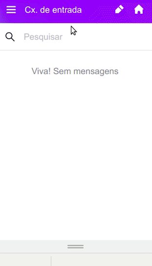
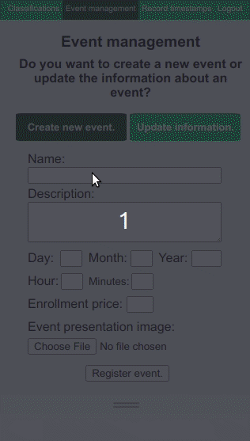
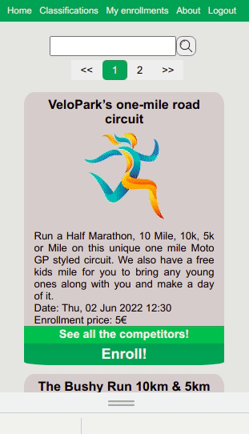
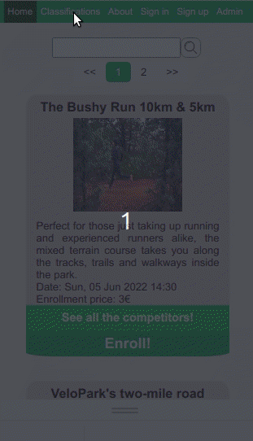

<h1>Running Events</h1>
<h2>https://running-events.herokuapp.com/</h2>

This is a mockup website (although completely functional) of a company that promotes and helps to organize running events, providing a web solution for event organizers. The website allows athletes to register and enroll for running, maintaining a persistent database with the users' information, which events they enrolled, if they confirmed payment and also their classifications and other statistics. Administrators can register new events and update the data concerning the athletes' performance in each race.

This platform is a RESTful WebApp implemented with the SpringBoot framework. The server-side layer makes use of Java for the business logic and the database was built with PostgreSQL and Java Persistence Architecture (JPA). The front-end consists in HTML, CSS and Javascript (jQuery library is widely used for requests to the server). Twilio Sendgrid API is used to send emails to the users, currently just to verify their accounts. This WebApp was developed by Lucas Werle Melz (https://lucasmelz.github.io/portfolio).

<h2>How to deploy the WebApp</h2>

The first thing to do to deploy the application is to create a PostgreSQL database and reference its credentials in the <i>application.yml</i> file, located in the following path: <i>runningEventsPublic/src/main/resources/</i>. After that, for the emailing system to work, it is necessary to create an account in Twilio Sendgrid (https://sendgrid.com), creating a Sender, selecting their Web API method for sending emails and finally generating an API key. That APIkey should be referenced at the <i>EmailService.java</i> file, located at the following path: <i>runningEventsPublic/src/main/java/com/example/Running/Events/email/EmailService.java</i>, line 52. After that, the WebApp is ready to be deployed! If you want to do it on your own machine, acess the source folder of the WebApp through the terminal and run the following commands (make sure you have Maven installed): 
  <code>mvn clean</code> 
  <code>mvn compile</code> 
  <code>mvn spring-boot:run</code> 

<h2>Tips for beginners</h2>

If you found this project interested to learn with it, and if you are feeling kind of lost, maybe the following tips will help you. To learn about how to create a RESTful WebApp using the SpringBoot framework, with a complete backend for user login and registration, and also learning about how to create a PostgreSQL database, I strongly suggest the following tutorial: 
https://www.youtube.com/watch?v=QwQuro7ekvc  
If you have doubts about how to integrate the Sendgrid Emailing System to the WebApp, it's all throughly explained in the following link: 
https://medium.com/javarevisited/sending-emails-with-sendgrid-and-spring-boot-81e9637a1f05

<h2>Persistent data storage using Spring Data JPA and PostgreSQL</h2>

  Sprint Data JPA is an add-on that provides a framework for a complete abstraction over the DAO(Data Access Object) layer.
  In other words, Spring Data JPA reduces the number of artifacts we need to define and mantain, providing consistent built-in
  patterns to access data and a consistent configuration. The entities that constitute the database of this WebApp are the following:
  <ul> 
    <li><b>app_user</b>: entity that represents the user. It has an unique identifier, a first name, last name, an user profile (admin or user),
    email (which is also the username), password, gender, a competitive category (corresponding to it's age), a variable that indicates if the
    account is verified or not (that is done through an activation link sent by email) and the list of events in which the user enrolled.</li>
    <li><b>app_user_event_enrollment_list</b>: this is the entity representing the list of enrollments of each user. </li>
    <li><b>confirmation_token</b>: confirmation token generated automatically for each new user that signs up. </li>
    <li><b>event</b>: each event has an unique identifier, a name, a description, variables corresponding to the date of the event, a temporal
      status(past, current or future) and an image. </li>
    <li><b>event_enrollment</b>: each enrollment has an unique identifier, one variable with the eventId in which the user enrolled, the username
    of the user enrolled, its na,e, gender and competitive category, as well as a reference for the payment of the enrollment fee and a boolean
    variable which states if the payment is confirmed or not.</li>
    <li><b>event</b>: each event has an unique identifier, a name, a description, variables corresponding to the date of the event, a temporal
      status(past, current or future) and an image. </li>
    <li><b>time_stamp</b>: this entity is used to store all the statistics concerning each athlete's performance. It has an unique identifier, a variable that stores the id of the corresponding event and variables to store the athlete's data (name, username, gender and competitive category). This entity has four LocalDateTime objects as instance variables to store the instants corresponding to four stages of the running, START, P1, P2, P3 and FINISH. The classifications are calculated based on these statistics in the front-end by accessing the timestamps of each running. The classifications are not stored in the database, only the timestamps.</li>
</ul>
 

 <h2>Endpoints</h2>
 

  <ul>
    <li><b>api/v1/getAppUserByUsername</b>: retrieves user data by submitting the corresponding username. Accessible to authenticated users and administrators.  </li>
    <li><b>api/v1/isUserEnrolled</b>: returns true or false determining if the authenticated user is already enrolled or not in an event. Accessible to authenticated users and administrators. </li>
    <li><b>api/v1/enrollEventUser</b>: by submitting an EventEnrollmentRequest, enrolls a user in an event. Accessible to authenticated users and administrators. </li>
    <li><b>api/v1/getEnrollmentsByEventId</b>: returns all enrollments in a determined event through the submission of the event identifier. Accessible to everyone.</li>
    <li><b>api/v1/getEvents</b>: returns all events registered on the database. Accessible to everyone. </li>
    <li><b>api/v1/register</b>: allows the registration of new users through a RegistrationRequest. Accessible to everyone. </li>
    <li><b>api/v1/registration/confirm?token=123456789</b>: this endpoint is used to verify an account by submitting the verification token. It is accessible to everyone. </li>
    <li><b>api/v1/isUserAuthenticated</b>: returns true or false depending on whether the user of the current session is authenticated or not. It is accessible to everyone.</li>
<li><b>/api/v1/username</b>: returns the username of the current authenticated user. Accessible to authenticated users and administrators.</li>
<li><b>/api/v1/confirmEnrollmentPayment</b>: allows to confirm the payment of an enrollment fee. Accessible to authenticated users and administrators. Since this is a mockup website and there is no payment system, this is used to simulate the confirmation of payment. Obviously in a real project, for security reasons, an endpoint like this one shouldn't be accessible to authenticated users.</li>
 <li><b>/api/v1/registerEvent</b>: allows to register a new event through the submission of an EventRegistrationRequest. Acessible only to administrators.</li>
 <li><b>/api/v1/updateName</b>: allows to update the name of an event. Acessible only to administrators.</li>
 <li><b>/api/v1/updateDescription</b>: allows to update the description of an event. Acessible only to administrators..</li>
 <li><b>/api/v1/updateDate</b>: allows to update the date of an event. Acessible only to administrators.</li>
 <li><b>/api/v1/updatePrice</b>: allows to update the enrollment fee of an event. Acessible only to administrators.</li>
 <li><b>/api/v1/updateImage</b>: allows to update the image of an event. Acessible only to administrators.</li>
 <li><b>/api/v1/doesEventExists</b>: returns true or false depending whether an event with the corresponding name exists or not. This information is relevant to forbid creating two events with the same name. It is acessible to everyone.</li>
 <li><b>/api/v1/searchEvent</b>: by submitting a String, this endpoint will return a page with 4 events which have a name, description or a date that somehow matches the input. If more than 4 events are returned from this search, you can also send to the server the number of the page (0 is the first page, 1 is the second page, etc). It is accessible to everyone.</li>
 <li><b>/api/v1/getEventsPageable</b>: returns a page of events. The events are sorted according to their date. The current and future events are showed first, the past events are showed last. You can submit the number the page and the number of items that each page should contain. It is accessible to everyone.</li>
 <li><b>/api/v1/getEventById</b>: returns the event with the corresponding identifier. Accessible to everyone.</li>
  </ul>
 

<h2>User interface</h2>
<h3>HTML Endpoints</h3>

All views are dinamically loaded in three different HTML pages, <i>index.html</i>, which is the interface accessible to the general public, <i>homepage.html</i>, which is the interface accessible only to authenticated users and <i>admin.html</i>, whose name is self-explanatory.

<h4>Registering new user and enrolling in an event</h4>

<h4>Registering new event</h4>

<h4>Updating event information</h4>

<h4>Registering athletes' timestamps and classification system</h4>

